# Hi, I’m Jessy 👋 — Azure Cloud Administrator

> *Passionate about cloud infrastructure, I build reliable and scalable solutions on Microsoft Azure.*

-----

## 🧠 About Me

- 🎯 Aspiring **Azure Cloud Administrator** focused on real-world deployments
- ☁️ Microsoft Azure enthusiast — from VMs to networking and identity management
- 🔧 I solve concrete problems with cloud technology
- 📚 Currently preparing for **AZ-104** (Microsoft Azure Administrator)
- 🚀 Self-taught, driven by results and continuous learning

-----

## 🏅 Certifications

|Badge|Certification                             |Score        |Year|
|-----|------------------------------------------|-------------|----|
|✅    |**AZ-900** — Microsoft Azure Fundamentals |**952/1000** |2026|
|🔄    |**AZ-104** — Microsoft Azure Administrator|*In progress*|2026|

-----

## 🛠️ Tech Stack

**Cloud Platform**


**Scripting & Automation**


**Tools**


-----

## 💼 Featured Projects

### 🖥️ GPU Cloud Workstation for Architecture & 3D Design

> *Real-world deployment — not a lab exercise*

A professional needed to run **SketchUp** and **V-Ray** but her local machine couldn’t handle the GPU requirements. I designed and deployed a full cloud workstation solution on Microsoft Azure.

**What I did:**

- Analyzed hardware requirements for SketchUp + V-Ray workloads
- Selected the **NV6ads A10 v5** VM (NVIDIA A10 GPU) — right-sized for 3D rendering
- Chose **West Europe** region to minimize latency for the end user
- Installed the **NVIDIA GPU extension** directly from Azure Portal
- Configured **auto-shutdown** to automatically stop the VM when not in use, reducing costs
- Contacted **Azure Support** to request a GPU quota increase
- Configured networking, RDP access, GPU drivers and software installation
- Delivered a fully functional cloud workstation to a non-technical user

**Key skills demonstrated:**
`VM sizing` `Cost optimization` `Latency awareness` `GPU extension configuration` `Quota management` `Azure Support` `End-user delivery`

### 📸 Project Walkthrough (Step by Step)

#### Step 1: The Challenge – Quota Management ⚠️
*Before I could even create the VM, I hit my first real-world Azure obstacle.*

| Step | Screenshot | Description |
|------|------------|-------------|
| **Quota Request** | 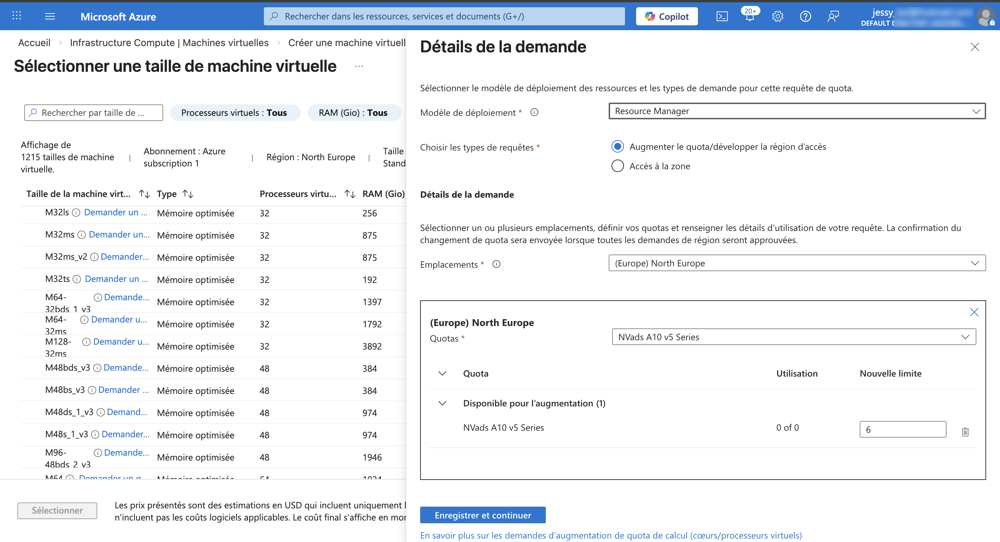 | Created a support ticket to increase GPU quota (NVads A10 v5 series) |
| **Request Details** | 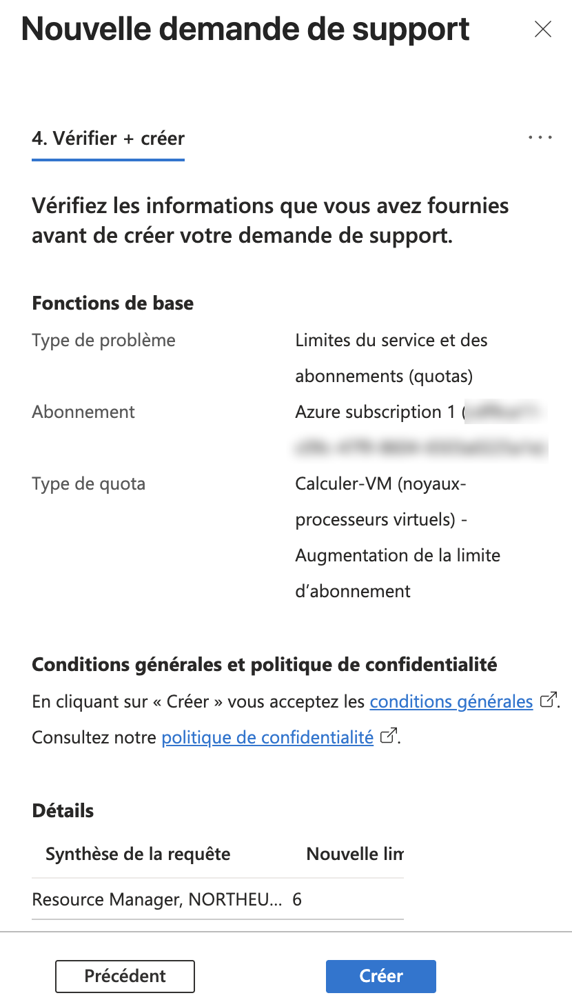 | Severity C, email contact, explained the professional use case |
| **Request Verification** | 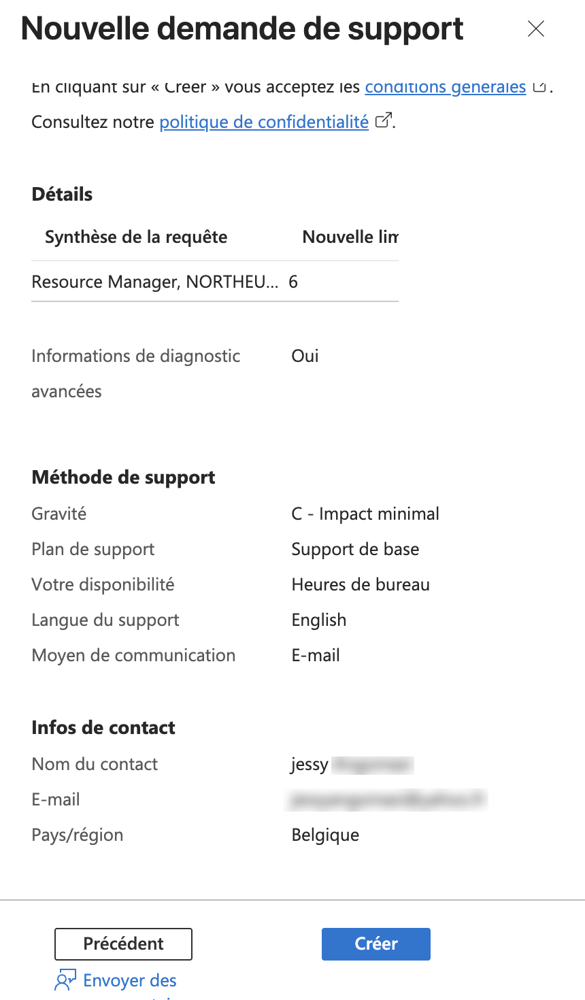 | Final verification before submitting |
| **Confirmation Email** | 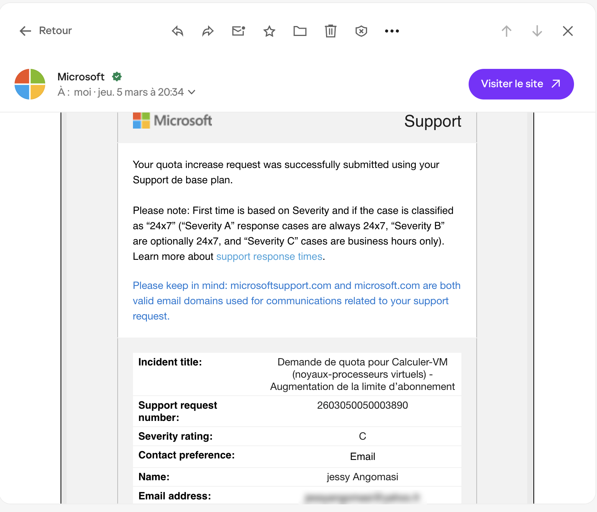 | Request successfully submitted to Azure Support |
| **Quota Approved** 🎉 | 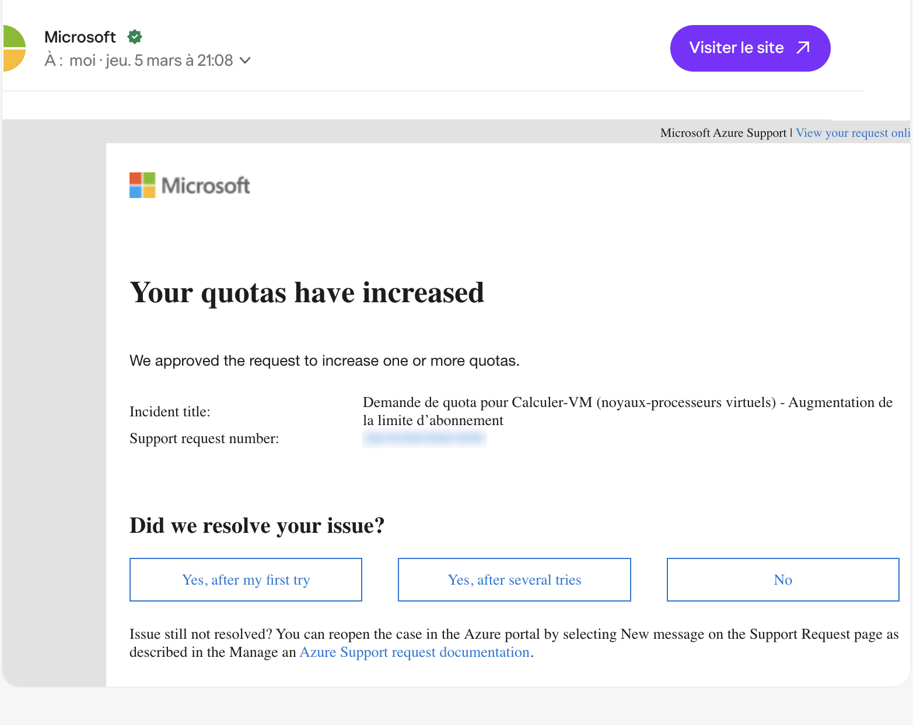 | **Approved in less than 24 hours!** |

---

#### Step 2: VM Creation & Configuration 🖥️
*With the quota approved, I could now deploy the solution.*

| Step | Screenshot | Description |
|------|------------|-------------|
| **VM Overview** | 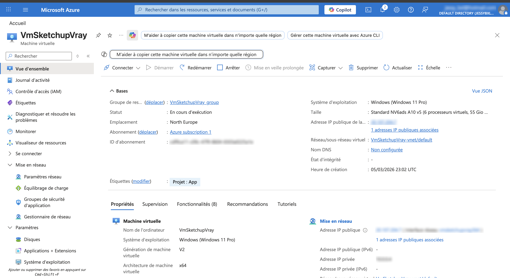 | VM `VmSketchupVray` running Windows 11 Pro in North Europe region |
| **OS Configuration** | 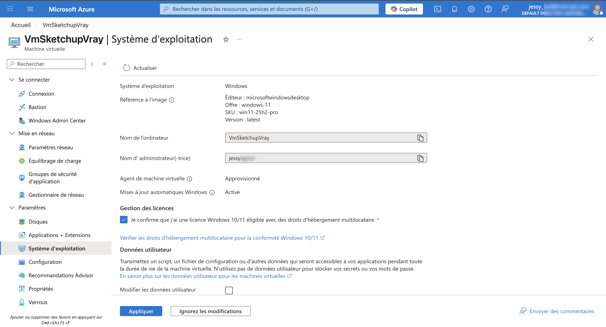 | Windows 11 Pro with administrator credentials configured |
| **Security Settings** | 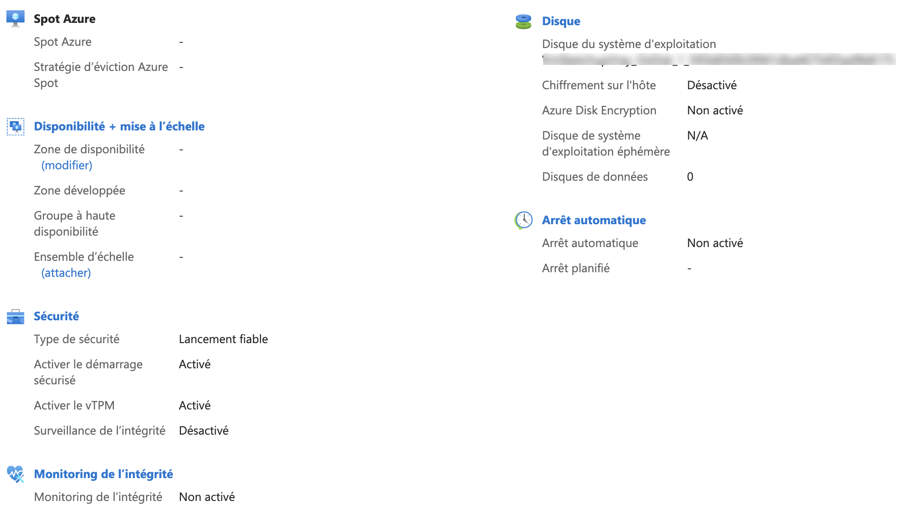 | Enabled **Trusted Launch**, **Secure Boot**, and **vTPM** for enhanced security |
| **Disk Configuration** | 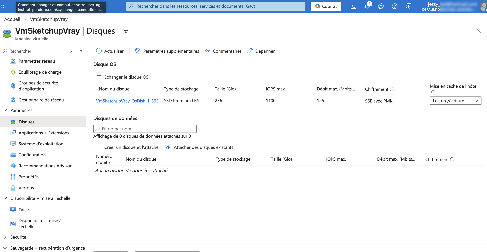 | 256 GiB Premium SSD LRS for OS disk |

---

#### Step 3: Network & Security Setup 🔌
*Configuring secure access and cost optimization.*

| Step | Screenshot | Description |
|------|------------|-------------|
| **Network Interface** | 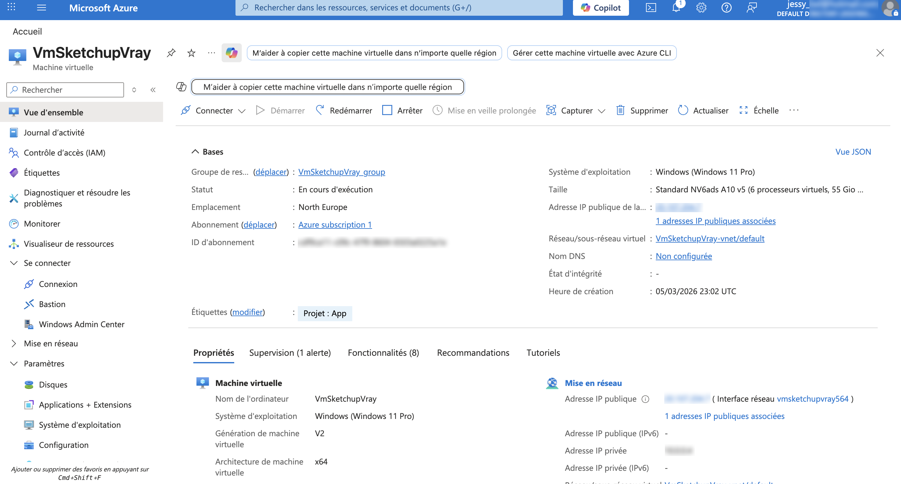 | VM attached to `VmSketchupVray-vnet` with private IP configuration |
| **NSG Rules** | 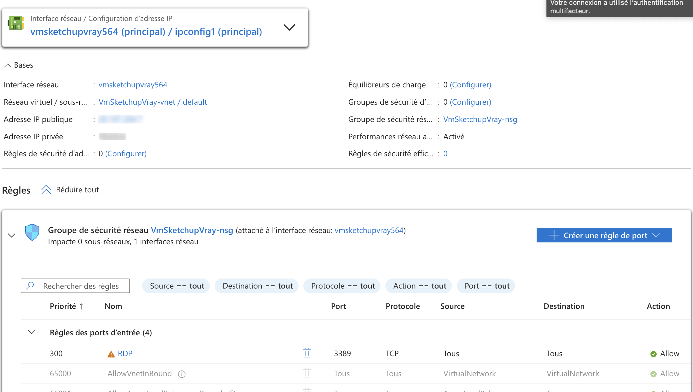 | Configured **RDP rule (port 3389)** for secure remote access |
| **Auto-shutdown** | 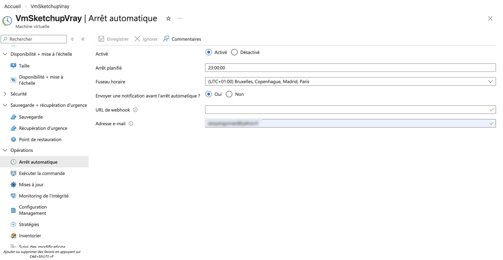 | Scheduled auto-shutdown at **23:00 (UTC+1)** to optimize costs — user only pays when working |

---

#### Step 4: GPU Driver Installation 🎮
*Installing NVIDIA drivers for 3D acceleration.*

| Step | Screenshot | Description |
|------|------------|-------------|
| **NVIDIA Extension** | 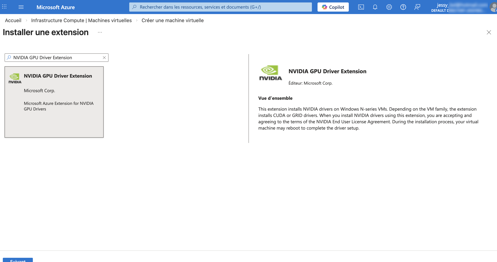 | Installed **NvidiaGpuDriverWindows** extension directly from Azure Portal |
| **Extension Details** | 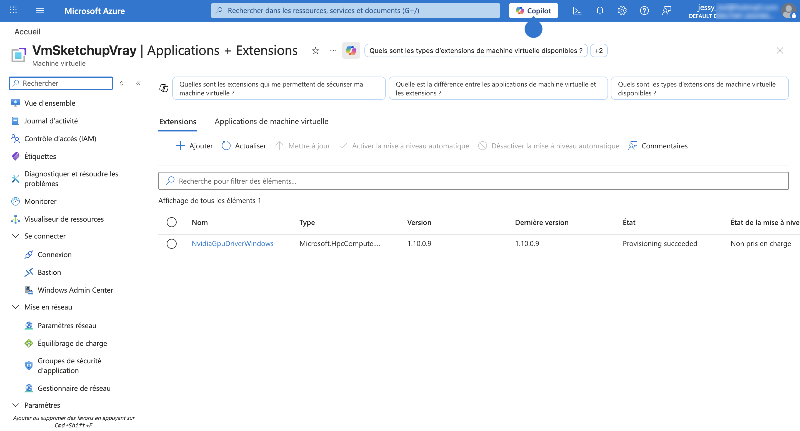 | Extension version 1.10.0.9 — **Provisioning succeeded** |
| **Extension Info** | 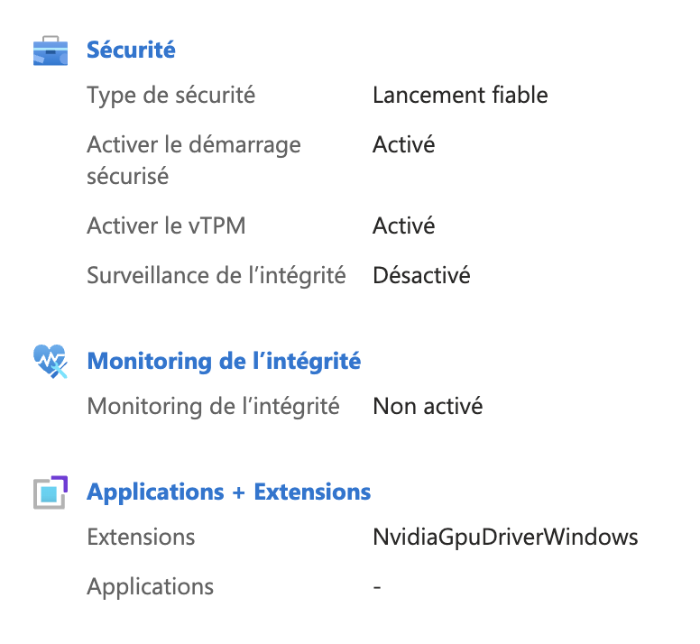 | Microsoft's official extension for NVIDIA GPU drivers on N-series VMs |

---

#### Step 5: Final Delivery & Result 🏁
*Delivering the solution to the end user.*

| Step | Screenshot | Description |
|------|------------|-------------|
| **VM Properties** | 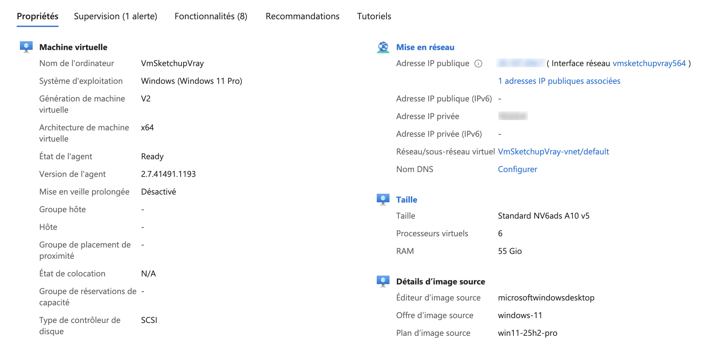 | VM fully configured and running |
| **RDP Connection** | 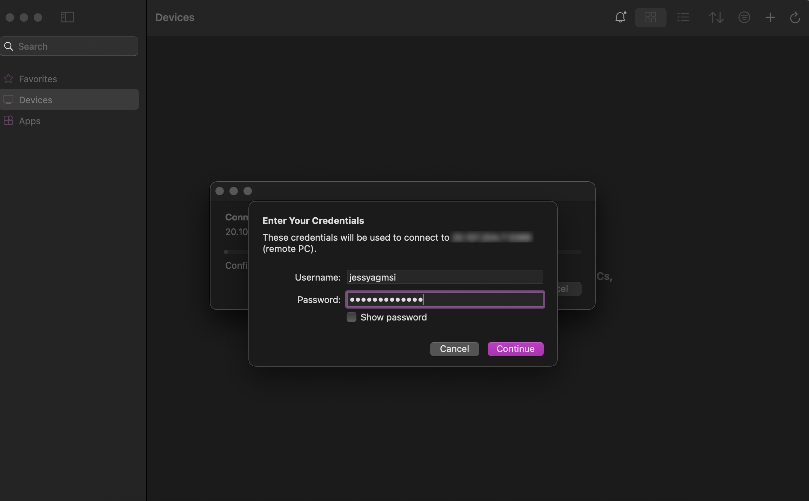 | Remote desktop credentials ready for user |
| **Connected Session** |  | Successfully connected to the VM |
| **SketchUp Running** 🏆 |  | **SketchUp running on Azure VM** — mission accomplished! |

---
**Result:** ✅ The user now runs professional 3D software seamlessly from any device, at optimized cost

-----

*More projects coming soon as I progress through AZ-104…*

-----

## 📈 My Learning Path

```
AZ-900 ✅ (952/1000) → AZ-104 🔄 → AZ-305 🎯 → Real-world projects 🚀
```

-----

## 📫 Let’s Connect

[](https://linkedin.com/)
[](mailto:jessyangomasi259@gmail.com)

-----

*“The best way to learn cloud is to build real things for real people.”*
<!--
**jessyangomasi259-beep/jessyangomasi259-beep** is a ✨ _special_ ✨ repository because its `README.md` (this file) appears on your GitHub profile.

Here are some ideas to get you started:

- 🔭 I’m currently working on ...
- 🌱 I’m currently learning ...
- 👯 I’m looking to collaborate on ...
- 🤔 I’m looking for help with ...
- 💬 Ask me about ...
- 📫 How to reach me: ...
- 😄 Pronouns: ...
- ⚡ Fun fact: ...
-->
